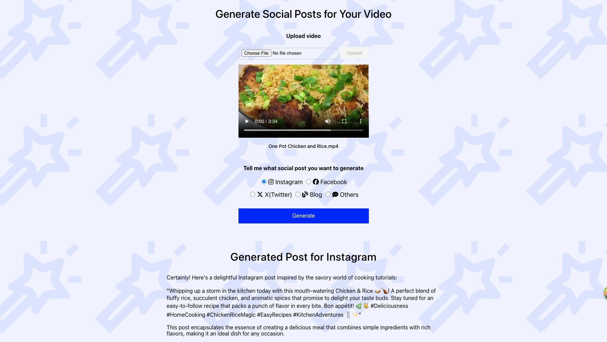

<a id="readme-top"></a>

# Generate Social Posts for Your Video

## 👋 Introduction

Use this app to effortlessly create social media posts of any type from short, fun Instagram updates to in-depth blog posts loaded with details. As a video content creator, you may already have fantastic video content. With this app, you can swiftly transform it into written content suitable for various social media platforms!

<div style="border: 1px solid black;">
  
</div>

### Built With

- [Twelve Labs API](https://docs.twelvelabs.io/docs)
- [JavaScript](https://developer.mozilla.org/en-US/docs/Web/JavaScript)
- [TypeScript](https://www.typescriptlang.org/)
- [React](https://react.dev/)
- [React Query](https://tanstack.com/query/latest)

<p align="right">(<a href="#readme-top">back to top</a>)</p>

## 🔑 Getting Started

### Step 1. Clone the repo

```sh
   git clone git@github.com:mrnkim/generate-social-posts.git
```

### Step 2. Generate API Key & Create an Index

1. Visit [Twelve Labs Playground](https://playground.twelvelabs.io/) to generate your API Key
   - Once you sign up, you'll receive complimentary credits allowing you to index up to 10 hours of video content!
2. [Create an index](https://docs.twelvelabs.io/reference/create-index) and save the index id
   - Make sure to set `engine_name` as `pegasus1` and `engine_options` as `visual`, `conversation`
   - index id looks something like `642c0581370f870fb3bb01be`
   - If you have already created index(es) before, retrieve the id(s) by making a [GET request to /indexes](https://docs.twelvelabs.io/reference/list-indexes)
3. Create `.env` file at the root level and store/update the values of each key.

   ```
   .env
   REACT_APP_API_URL=https://api.twelvelabs.io/v1.2
   REACT_APP_SERVER_URL=<YOUR_SERVER_URL> //e.g., http://localhost
   REACT_APP_PORT_NUMBER=<YOUR_PORT_NUMBER> //e.g., 4001
   REACT_APP_API_KEY=<YOUR_API_KEY>
   REACT_APP_INDEX_ID=<YOUR_INDEX_ID>
   ```

### Step 3. Start the App

1. Start the server

   ```
   nodemon server.js
   ```

2. Install and start the client

   ```
   npm install
   npm start
   ```

<p align="right">(<a href="#readme-top">back to top</a>)</p>

## 🎯 What's Next?

- Add tests
- Improve error handling and add data validations

<p align="right">(<a href="#readme-top">back to top</a>)</p>
